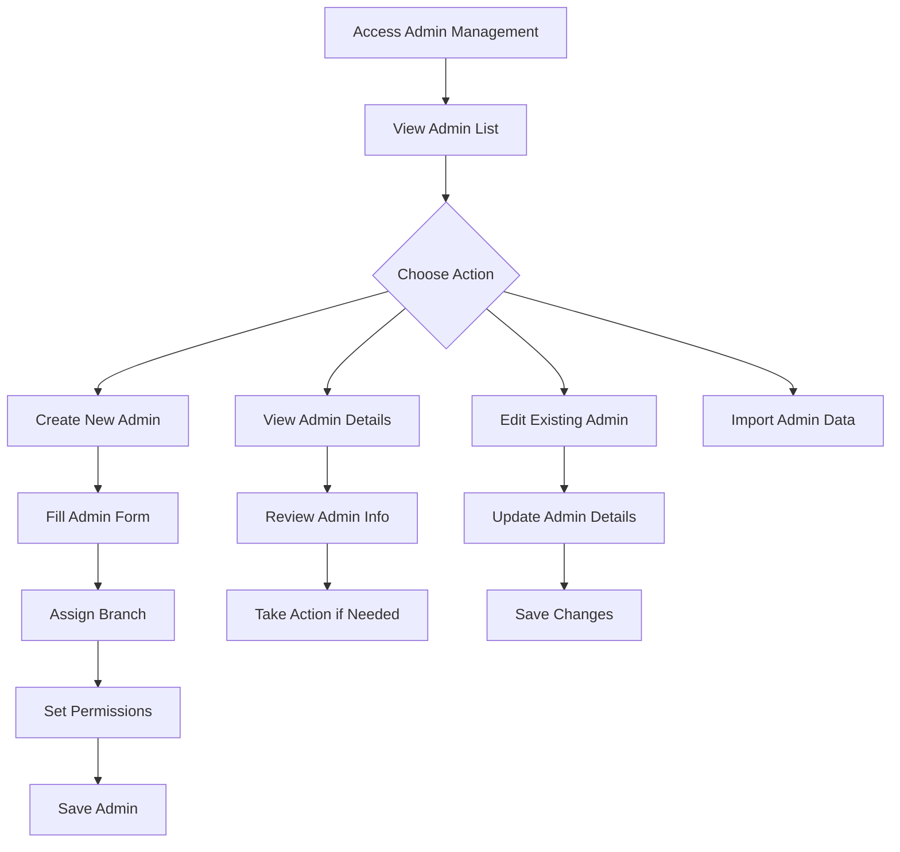
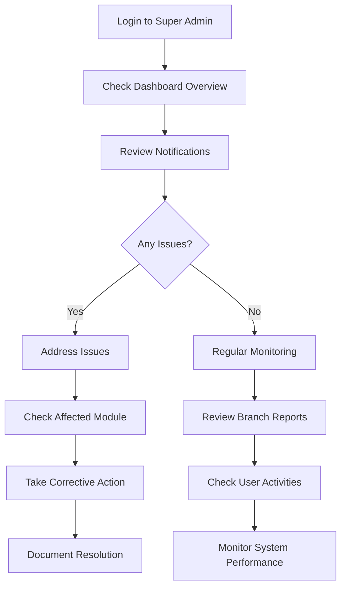
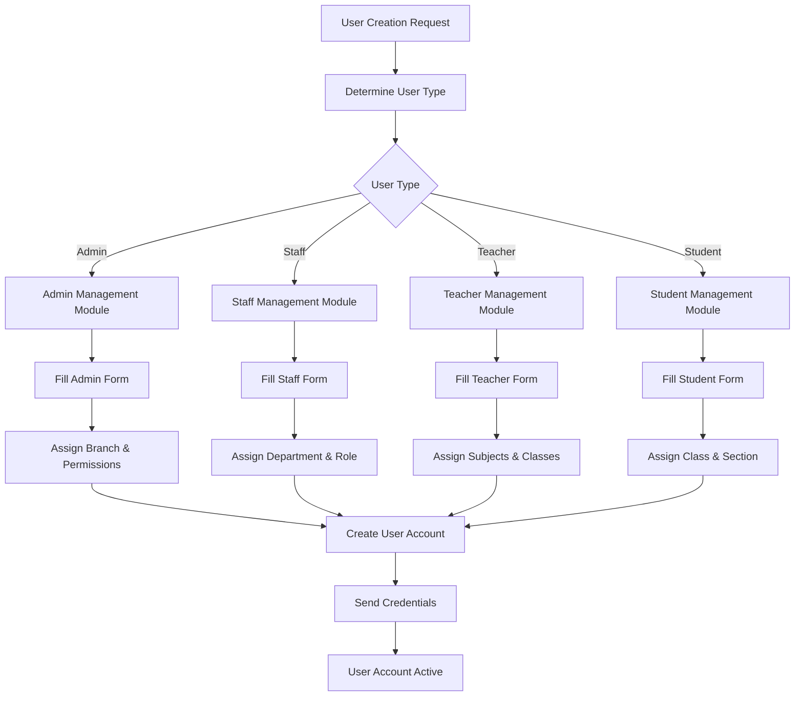
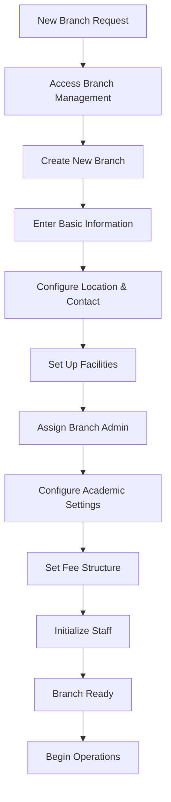
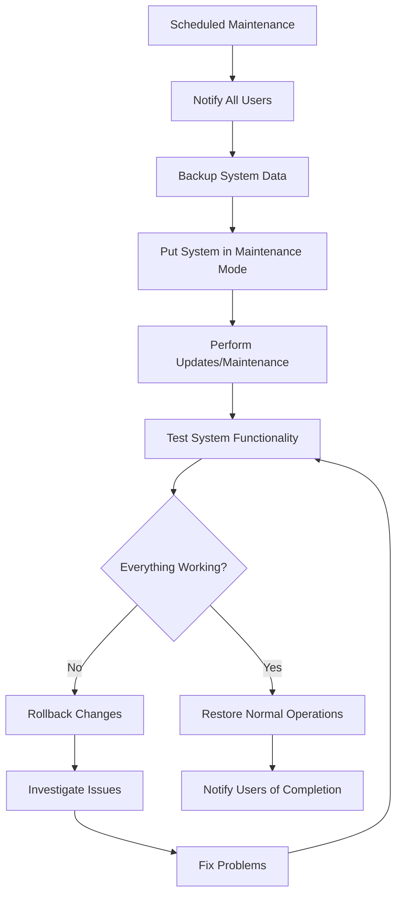

# Super Admin Panel - User Manual & Workflow Guide
**Nurul Hiqamah Model Madrasa Management System**

---

## Table of Contents

1. [System Overview](#system-overview)
2. [Getting Started](#getting-started)
3. [Navigation & Interface](#navigation--interface)
4. [Core Modules](#core-modules)
5. [User Management](#user-management)
6. [Branch Management](#branch-management)
7. [Settings Management](#settings-management)
8. [Workflows](#workflows)
9. [Best Practices](#best-practices)
10. [Troubleshooting](#troubleshooting)

---

## System Overview

The Super Admin Panel is the highest level of control in the Nurul Hiqamah Model Madrasa Management System. It provides centralized management capabilities for:

- **User Management**: Complete control over all user types
- **Branch Management**: Multi-branch institution management
- **System Settings**: Global configuration and preferences
- **Data Oversight**: System-wide monitoring and control

### Key Features:
✅ **Multi-branch Support**: Manage multiple institution branches  
✅ **Role-based Access**: Hierarchical user permission system  
✅ **Centralized Control**: One interface to manage everything  
✅ **Scalable Architecture**: Designed for institutional growth  

---

## Getting Started

### System Access
- **URL**: `https://admin.mnab.info/super-admin/login`
- **Default Credentials**: `superadmin@gmail.com`
- **Dashboard URL**: `https://admin.mnab.info/super-admin`

### System Requirements
- **Browser**: Chrome, Firefox, Safari, Edge (latest versions)
- **Screen Resolution**: Minimum 1024x768
- **Internet Connection**: Stable broadband connection
- **JavaScript**: Must be enabled

### First Login Process
1. Navigate to the login URL
2. Enter super admin credentials
3. Click "SUBMIT" button
4. Access granted to main dashboard

---

## Navigation & Interface

### Dashboard Layout
```
┌─────────────────────────────────────────────────────────┐
│ HEADER: Nurul Hiqamah Model Madrasa                    │
├─────────────────────────────────────────────────────────┤
│ TITLE: Super Admin Dashboard                            │
├─────────────────────────────────────────────────────────┤
│ SIDEBAR                    │ MAIN CONTENT AREA          │
│                           │                             │
│ Admin Management:         │ [Selected Module Content]   │
│ • Admin Management        │                             │
│ • Staff Management        │                             │
│ • Teacher Management      │                             │
│ • Student Management      │                             │
│                           │                             │
│ Branch Management:        │                             │
│ • Branches Management     │                             │
│                           │                             │
│ Profile Management:       │                             │
│ • Settings Management     │                             │
└───────────────────────────┴─────────────────────────────┘
```

### Menu Structure
The sidebar is organized into three main sections:

**1. Admin Management**
- Admin Management
- Staff Management  
- Teacher Management
- Student Management

**2. Branch Management**
- Branches Management

**3. Profile Management**
- Settings Management

---

## Core Modules

### Module Capabilities
Each module provides CRUD (Create, Read, Update, Delete) operations with:
- **List View**: Display all records with pagination
- **Details View**: View individual record details
- **Create Form**: Add new records
- **Edit Form**: Modify existing records
- **Delete Function**: Remove records
- **Import Function**: Bulk data import
- **Search & Filter**: Find specific records

---

## User Management

### Admin Management (`/user-admins`)

**Purpose**: Manage system administrators who can access branch-level controls

#### Features:
- **Create New Admins**: Add administrators for specific branches
- **View Admin List**: See all system administrators
- **Edit Admin Details**: Update admin information and permissions
- **Admin Details**: View complete administrator profiles
- **Deactivate/Activate**: Control admin access

#### Admin Workflow:


#### Admin Fields:
- Personal Information (Name, Email, Phone)
- Branch Assignment
- Permission Level
- Status (Active/Inactive)
- Creation Date
- Last Login

### Staff Management (`/user-staffs`)

**Purpose**: Manage non-teaching staff across all branches

#### Features:
- **Staff Directory**: Complete staff database
- **Department Assignment**: Organize by departments
- **Role Management**: Define staff roles and responsibilities
- **Performance Tracking**: Monitor staff performance

#### Staff Categories:
- Administrative Staff
- Support Staff
- Maintenance Staff
- Security Staff
- Other Support Personnel

### Teacher Management (`/user-teachers`)

**Purpose**: Oversee all teaching staff across the institution

#### Features:
- **Teacher Profiles**: Complete teacher information
- **Qualification Management**: Track educational credentials
- **Subject Assignment**: Link teachers to subjects
- **Performance Monitoring**: Track teaching effectiveness

#### Teacher Information:
- Personal & Contact Details
- Educational Qualifications
- Teaching Experience
- Subject Specializations
- Branch Assignment
- Employment Status

### Student Management (`/user-students`)

**Purpose**: Central student database and management

#### Features:
- **Student Registry**: Complete student database
- **Academic Records**: Track student progress
- **Branch Transfer**: Move students between branches
- **Graduation Management**: Handle student completions

#### Student Data:
- Personal Information
- Academic Records
- Guardian Information
- Fee Status
- Branch Assignment
- Enrollment Status

---

## Branch Management

### Branches Management (`/branches`)

**Purpose**: Configure and manage multiple institution branches

#### Branch Operations:

**1. Create New Branch**
```
Branch Setup Process:
1. Basic Information
   - Branch Name
   - Branch Code
   - Address & Location
2. Contact Details
   - Phone Numbers
   - Email Address
   - Emergency Contacts
3. Facilities Information
   - Buildings & Rooms
   - Equipment & Resources
   - Capacity Details
4. Administrative Setup
   - Branch Admin Assignment
   - Staff Allocation
   - Initial Configuration
```

**2. Branch Configuration**
- **Academic Settings**: Configure academic years, terms
- **Fee Structure**: Set up branch-specific fees
- **Facility Management**: Manage buildings, rooms, resources
- **Staff Assignment**: Assign administrators and staff

**3. Branch Monitoring**
- **Performance Metrics**: Track branch performance
- **Student Enrollment**: Monitor student numbers
- **Financial Overview**: Branch-specific financial data
- **Compliance Status**: Ensure regulatory compliance

#### Branch Information Fields:
- **Basic Details**: Name, Code, Type
- **Location**: Full Address, GPS Coordinates
- **Contact Information**: Phone, Email, Website
- **Facilities**: Buildings, Classrooms, Resources
- **Capacity**: Student Capacity, Staff Capacity
- **Status**: Active, Inactive, Under Development

---

## Settings Management

### System Settings (`/settings`)

**Purpose**: Global system configuration and preferences

#### Settings Categories:

**1. System Configuration**
- Application Settings
- Security Settings
- Backup Configuration
- Integration Settings

**2. Academic Configuration**
- Academic Year Settings
- Grading System
- Assessment Methods
- Reporting Formats

**3. Communication Settings**
- Email Configuration
- SMS Settings
- Notification Preferences
- Alert Systems

**4. Financial Settings**
- Currency Settings
- Payment Methods
- Fee Calculation Rules
- Financial Year Configuration

---

## Workflows

### Daily Operations Workflow



### User Creation Workflow



### Branch Setup Workflow



### System Maintenance Workflow



---

## Best Practices

### Security Best Practices

1. **Access Control**
   - Regularly review user permissions
   - Deactivate unused accounts
   - Use strong password policies
   - Enable two-factor authentication when available

2. **Data Protection**
   - Regular system backups
   - Secure data transmission
   - Monitor user activities
   - Implement data retention policies

### Operational Best Practices

1. **User Management**
   - Maintain accurate user records
   - Regular permission audits
   - Clear role definitions
   - Proper onboarding/offboarding processes

2. **Branch Management**
   - Regular branch performance reviews
   - Standardized procedures across branches
   - Clear communication channels
   - Resource allocation monitoring

3. **System Maintenance**
   - Regular system updates
   - Performance monitoring
   - Proactive issue resolution
   - Documentation of all changes

### Data Management Best Practices

1. **Data Quality**
   - Regular data validation
   - Duplicate record prevention
   - Consistent data entry standards
   - Regular data cleaning

2. **Reporting**
   - Regular performance reports
   - Trend analysis
   - Stakeholder communication
   - Data-driven decision making

---

## Troubleshooting

### Common Issues & Solutions

#### Login Issues
**Problem**: Cannot access super admin panel
**Solutions**:
1. Verify correct URL: `https://admin.mnab.info/super-admin/login`
2. Check credentials: `superadmin@gmail.com`
3. Clear browser cache and cookies
4. Try different browser
5. Check internet connection

#### Page Loading Issues
**Problem**: Pages load slowly or not at all
**Solutions**:
1. Check internet connection speed
2. Clear browser cache
3. Disable browser extensions
4. Try incognito/private browsing mode
5. Contact technical support if persistent

#### Data Not Saving
**Problem**: Forms submit but data doesn't save
**Solutions**:
1. Check all required fields are filled
2. Verify data format (phone numbers, emails)
3. Check for duplicate entries
4. Try refreshing the page and resubmitting
5. Contact support for database issues

#### Permission Errors
**Problem**: "Access Denied" or permission errors
**Solutions**:
1. Verify super admin login status
2. Check if session has expired
3. Re-login to refresh permissions
4. Contact system administrator

### Error Messages

| Error Message | Cause | Solution |
|---------------|--------|----------|
| "Session Expired" | User session timeout | Re-login to system |
| "Access Denied" | Insufficient permissions | Verify super admin access |
| "Data Not Found" | Record doesn't exist | Check data availability |
| "Validation Error" | Form data invalid | Review and correct form data |
| "Server Error" | System malfunction | Contact technical support |

### Support Contacts

- **Technical Support**: [Contact Information]
- **System Administrator**: [Contact Information]
- **Emergency Contact**: [Contact Information]

---

## System Specifications

### Technical Requirements
- **Frontend**: React.js with TypeScript
- **Backend**: FastAPI with Node.js
- **Database**: SQL Database (PostgreSQL/MySQL)
- **Authentication**: JWT-based authentication
- **File Storage**: Local/Cloud storage for documents
- **API**: RESTful API architecture

### Performance Specifications
- **Response Time**: < 2 seconds for standard operations
- **Concurrent Users**: Supports 100+ concurrent users
- **Data Capacity**: Unlimited user/branch capacity
- **Uptime**: 99.9% availability target
- **Backup Frequency**: Daily automated backups

---

## Version Information
- **Document Version**: 1.0
- **System Version**: Latest
- **Last Updated**: August 2025
- **Created By**: System Documentation Team

---

## Appendices

### Appendix A: Field Definitions
[Detailed field definitions for all forms and modules]

### Appendix B: API Endpoints
[Complete API endpoint documentation for developers]

### Appendix C: Database Schema
[Database structure and relationships]

### Appendix D: Security Policies
[Detailed security policies and procedures]

---

**© 2025 Nurul Hiqamah Model Madrasa Management System. All rights reserved.**
